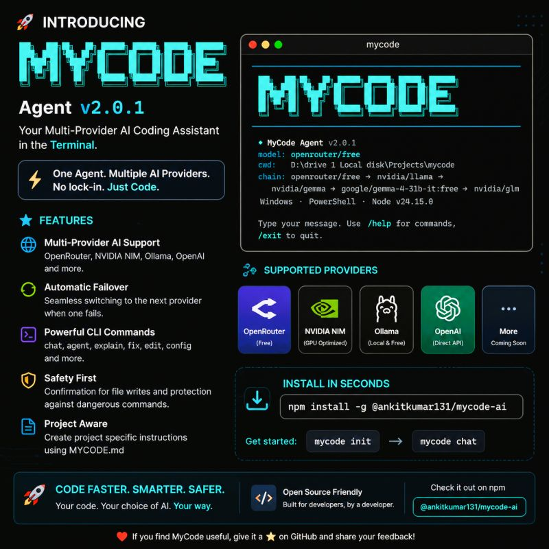

<div align="center">

# 🚀 MYCODE

### **Your Universal AI Coding Agent in the Terminal**

*One Agent. Any AI Provider. No Lock-in. Just Code.*

<br />



<br />

[](https://www.npmjs.com/package/@ankitkumar131/mycode-ai)
[](https://opensource.org/licenses/MIT)
[](https://nodejs.org/)
[](https://www.typescriptlang.org/)
[](https://github.com/anomalyco/mycode/pulls)

<br />

**Like Claude Code, but works with _any_ AI provider — just bring your API key.**

[📦 Install](#-quick-start) · [📖 Docs](#-cli-commands) · [🔌 How It Works](#-how-it-works--any-api-provider) · [🤖 Agent Mode](#-agent-mode) · [🛠️ SDK](#-sdk--plugins) · [💬 Community](https://github.com/anomalyco/mycode/discussions)

</div>

---

<br />

## ⚡ Why MyCode?

Most AI coding tools lock you into a single provider. **MyCode breaks that wall.**

> MyCode works with **any AI provider that has an API**. Just provide your **API provider**, **API URL**, **model name**, and **API key** — and you're ready to code. OpenRouter, NVIDIA NIM, Ollama, OpenAI, Groq, Together AI, Mistral, Fireworks, DeepSeek, or your own self-hosted endpoint — **if it has an API, MyCode can use it.**

<table>
<tr>
<td width="50%">

### 🎯 The Problem
- Locked into one AI provider
- No fallback when services go down
- Expensive API costs with no alternatives
- Can't use local models for privacy
- Each tool needs its own setup & config

</td>
<td width="50%">

### ✅ The MyCode Solution
- **Any AI provider** — just enter API details
- **Automatic failover** chain keeps you coding
- **Free tiers** available via OpenRouter & Ollama
- **Local models** via Ollama — fully private & offline
- **One setup** — `mycode init` and you're done

</td>
</tr>
</table>

<br />

---

## 🔌 How It Works — Any API Provider

MyCode uses a **universal OpenAI-compatible interface**. This means it works with virtually any AI provider out of the box. When you run `mycode init`, the setup wizard asks just **4 things**:

```
┌──────────────────────────────────────────────┐
│          ⚡ MyCode Setup Wizard              │
│                                              │
│  1. API Provider   → openai / openrouter /   │
│                      ollama / nvidia_nim /   │
│                      custom                  │
│                                              │
│  2. Model Name     → e.g. gpt-4o,            │
│                      llama3.1:8b,            │
│                      claude-sonnet-4         │
│                                              │
│  3. API Key        → your provider's key     │
│                                              │
│  4. API Base URL   → the provider's endpoint │
│                      e.g. https://api.xxx/v1 │
└──────────────────────────────────────────────┘
```

That's it. **Any API provider, any model, one command.**

### Works With Any OpenAI-Compatible API

Since most AI providers today follow the OpenAI chat completions format, MyCode's **"Custom"** provider option lets you connect to literally anything:

| Provider | API Base URL | Works? |
|:---|:---|:---:|
| OpenRouter | `https://openrouter.ai/api/v1` | ✅ |
| OpenAI | `https://api.openai.com/v1` | ✅ |
| NVIDIA NIM | `https://integrate.api.nvidia.com/v1` | ✅ |
| Ollama (local) | `http://localhost:11434` | ✅ |
| Groq | `https://api.groq.com/openai/v1` | ✅ |
| Together AI | `https://api.together.xyz/v1` | ✅ |
| Fireworks AI | `https://api.fireworks.ai/inference/v1` | ✅ |
| Mistral AI | `https://api.mistral.ai/v1` | ✅ |
| DeepSeek | `https://api.deepseek.com/v1` | ✅ |
| Azure OpenAI | Your deployment URL | ✅ |
| LM Studio (local) | `http://localhost:1234/v1` | ✅ |
| Any OpenAI-compatible API | Your custom URL | ✅ |

> [!TIP]
> Use the **"Custom"** provider type during `mycode init` to connect to any endpoint that follows the OpenAI chat completions API format.

<br />

---

## 🌟 Features

<table>
<tr>
<td align="center" width="33%">
<br />
<h3>🌐 Universal AI Provider</h3>
<p>Connect to <strong>any</strong> AI API — just provide the URL, model, and key. No vendor lock-in</p>
</td>
<td align="center" width="33%">
<br />
<h3>🔄 Automatic Failover</h3>
<p>Chain multiple providers with priority — seamless switching when one fails</p>
</td>
<td align="center" width="33%">
<br />
<h3>🤖 AI Agent Mode</h3>
<p>Autonomous tool use — reads, writes, searches, and runs commands</p>
</td>
</tr>
<tr>
<td align="center" width="33%">
<br />
<h3>🛡️ Safety First</h3>
<p>Confirmation for file writes & dangerous commands. You stay in control</p>
</td>
<td align="center" width="33%">
<br />
<h3>📁 Project Aware</h3>
<p>MYCODE.md for project-specific context, conventions & instructions</p>
</td>
<td align="center" width="33%">
<br />
<h3>🔌 Extensible SDK</h3>
<p>Build plugins, custom tools, and custom providers with the SDK</p>
</td>
</tr>
<tr>
<td align="center" width="33%">
<br />
<h3>🌐 A2A Protocol</h3>
<p>Agent-to-Agent server for multi-agent orchestration</p>
</td>
<td align="center" width="33%">
<br />
<h3>🖥️ Beautiful Terminal UI</h3>
<p>Rich markdown rendering, spinners, colored output powered by Ink</p>
</td>
<td align="center" width="33%">
<br />
<h3>📦 Standalone Binary</h3>
<p>Build as a Single Executable App — no Node.js required to run</p>
</td>
</tr>
</table>

<br />

---

## 📦 Quick Start

### 1. Install globally

```bash
npm install -g @ankitkumar131/mycode-ai
```

### 2. Set up your AI provider

```bash
mycode init
```

The interactive wizard will ask you:
- **API Provider** — choose a preset (OpenRouter, OpenAI, NVIDIA NIM, Ollama) or select **Custom** for any other provider
- **Model Name** — pick from suggested models or enter any model identifier
- **API Key** — your provider's API key (not needed for Ollama)
- **Base URL** — auto-filled for presets, or enter your custom endpoint

### 3. Start coding

```bash
mycode chat
```

That's it! 🎉

<br />

### Example: Connect to Groq in 30 Seconds

```bash
$ mycode init

⚡ MyCode Setup Wizard

? Priority: 1
? Provider name: groq
? Choose your AI provider: ⚙️  Custom (any OpenAI-compatible endpoint)
? Enter the model identifier: llama-3.1-70b-versatile
? Enter your API key: gsk_xxxxxxxxxxxxxxx
? Enter the API base URL: https://api.groq.com/openai/v1

✓ Added provider: groq

$ mycode chat
```

> [!NOTE]
> You can add **multiple providers** during setup for automatic failover. If provider #1 goes down, MyCode seamlessly switches to provider #2, then #3, and so on.

<br />

---

## 🔄 Multi-Provider Failover

MyCode's killer feature: **chain multiple AI providers with priority-based automatic failover.**

```bash
$ mycode init
# Add provider #1: OpenRouter (priority 1)
# Add provider #2: Ollama local (priority 2)
# Add provider #3: OpenAI (priority 3)
```

Now your failover chain looks like:

```
Request → OpenRouter → (fails?) → Ollama → (fails?) → OpenAI
```

### How Failover Works

| Error Type | Behavior |
|:---|:---|
| 🚫 Rate Limited (429) | Wait briefly, then try next provider |
| 💥 Server Error (5xx) | Immediately try next provider |
| 🔐 Auth Error (401/403) | Skip provider, warn user |
| 📏 Context Too Long | Try next provider (may have larger window) |
| 🔌 Connection Refused | Skip provider (offline) |

Each provider also has **read/write permissions**, so you can use a free provider for code explanation but restrict file writes to a trusted provider.

<br />

---

## 💻 CLI Commands

| Command | Description |
|:---|:---|
| `mycode chat` | 💬 Start an interactive AI chat session |
| `mycode agent` | 🤖 Start AI agent with autonomous tool use |
| `mycode explain <file>` | 📖 Get AI explanation of any code file |
| `mycode fix <file>` | 🔧 Detect and fix bugs in your code |
| `mycode edit <file>` | ✏️ Edit code with AI assistance |
| `mycode review <file>` | 🔍 AI-powered code review with suggestions |
| `mycode config` | ⚙️ Manage configuration (set/get/list/reset) |
| `mycode init` | 🚀 Set up providers interactively |
| `mycode doctor` | 🩺 System diagnostics & provider health check |

### Global Options

```bash
mycode <command> --provider <name>   # Override default provider
mycode <command> --model <name>      # Override default model
mycode <command> --verbose           # Enable verbose logging
mycode <command> --no-color          # Disable colored output
```

<br />

---

## 🤖 Agent Mode

Agent mode gives MyCode **autonomous superpowers**. It can think, plan, and execute multi-step tasks using built-in tools:

```bash
mycode agent
```

### Available Agent Tools

| Tool | Description |
|:---|:---|
| `read_file` | 📄 Read file contents with optional line ranges |
| `write_file` | ✍️ Create or overwrite files (with confirmation) |
| `edit_file` | 🔧 Surgical find-and-replace editing |
| `list_directory` | 📂 List directory contents with metadata |
| `search_files` | 🔎 Glob-based file pattern search |
| `search_code` | 🔍 Regex code search across your project |
| `run_command` | ⚡ Execute shell commands (with safety guards) |
| `web_search` | 🌐 Search the web for information |

> [!IMPORTANT]
> **Safety by design** — All file writes and dangerous shell commands (rm, del, format, etc.) require your explicit confirmation before execution. You always stay in control.

### Agent Loop

```
Observe → Think → Plan → Act → Repeat
```

The agent reads your codebase, understands context, plans actions, executes them with tools, and iterates until the task is complete.

<br />

---

## 📁 Project Context with MYCODE.md

Make MyCode understand your project deeply by creating a `.mycode/MYCODE.md` file:

```bash
mycode init
```

This generates a project context file where you can define:

```markdown
# Project: My Awesome App

## Tech Stack
- Language: TypeScript
- Framework: React + Next.js
- Database: PostgreSQL
- Package Manager: pnpm

## Conventions
- Use functional components
- Follow Airbnb ESLint config
- Use kebab-case for file names

## Instructions
- Always add unit tests for new features
- Use Tailwind CSS for styling
- Follow the repository's PR template
```

MyCode automatically loads this context into every AI interaction, making responses **project-aware and consistent**.

<br />

---

## ⚙️ Configuration

Your provider configuration is stored in `~/.mycode/settings.json`. You can manage it via the CLI:

```bash
# View current config
mycode config list

# Test all provider connections
mycode config test

# Reset configuration
mycode config reset
```

### Settings Structure

```json
{
  "providers": [
    {
      "priority": 1,
      "name": "my-openrouter",
      "api_provider": "openrouter",
      "model": "google/gemini-2.5-flash",
      "api_key": "sk-or-...",
      "base_url": "https://openrouter.ai/api/v1",
      "read": true,
      "write": true,
      "max_retries": 3
    },
    {
      "priority": 2,
      "name": "local-ollama",
      "api_provider": "ollama",
      "model": "llama3.1:8b",
      "base_url": "http://localhost:11434",
      "read": true,
      "write": true,
      "max_retries": 3
    }
  ],
  "preferences": {
    "theme": "dark",
    "confirm_writes": true,
    "confirm_commands": true,
    "log_conversations": true
  }
}
```

<br />

---

## 🏗️ Architecture

MyCode is built as a **TypeScript monorepo** with a clean layered architecture:

```
┌─────────────────────────────────────────────────┐
│                   CLI Layer                     │
│          Commander + Ink (React Terminal UI)    │
├─────────────────────────────────────────────────┤
│                  Core Layer                     │
│     Provider Router │ Agent Loop │ Tool System  │
├─────────────────────────────────────────────────┤
│               Provider Layer                    │
│   OpenAI-Compatible Adapter │ Ollama Adapter    │
│   (works with ANY API endpoint)                 │
├─────────────────────────────────────────────────┤
│                  SDK Layer                      │
│       Plugin API │ Custom Tools │ Extensions    │
├─────────────────────────────────────────────────┤
│               A2A Server Layer                  │
│         Agent-to-Agent Protocol Server          │
└─────────────────────────────────────────────────┘
```

### Monorepo Packages

| Package | Description |
|:---|:---|
| `@mycode/cli` | CLI frontend with Ink-based terminal UI |
| `@mycode/core` | Core engine — providers, tools, agent, config |
| `@mycode/sdk` | SDK for building plugins & extensions |
| `@mycode/a2a-server` | Agent-to-Agent protocol server |
| `@mycode/devtools` | Developer tools & debugging utilities |
| `@mycode/test-utils` | Test utilities, mocks & fixtures |

### The Provider Router — MyCode's Core Innovation

The **Provider Router** is the heart of MyCode. It takes your configured providers (sorted by priority) and uses a simple but powerful pattern:

1. All providers are wrapped in a **universal `OpenAICompatibleProvider`** adapter (except Ollama, which has its own adapter)
2. On each request, the router tries providers **in priority order**
3. If a provider fails, the router **automatically fails over** to the next one
4. Providers track their own **health metrics** (success rate, failures, availability)

This is why you can plug in **any API endpoint** — as long as it speaks the OpenAI chat completions format, MyCode handles the rest.

<br />

---

## 🛠️ SDK & Plugins

Build custom extensions with the MyCode SDK:

```typescript
import { MyCodeSDK } from '@mycode/sdk';

const sdk = new MyCodeSDK();

// Register a custom tool
sdk.registerTool({
  name: 'deploy',
  description: 'Deploy the application',
  parameters: { environment: { type: 'string' } },
  execute: async ({ environment }) => {
    return { success: true, url: `https://${environment}.myapp.com` };
  }
});

// Register a custom provider
sdk.registerProvider({
  name: 'my-custom-llm',
  chat: async (messages) => { /* ... */ },
  isAvailable: async () => true,
});
```

<br />

---

## 🌐 A2A Protocol

MyCode includes an **Agent-to-Agent (A2A) protocol server**, enabling multi-agent orchestration:

```bash
mycode a2a-server --port 3000
```

This exposes MyCode's capabilities to other A2A-compatible agents, enabling complex multi-agent workflows.

<br />

---

## 🧑‍💻 Development

```bash
# Clone the repository
git clone https://github.com/anomalyco/mycode.git
cd mycode

# Install dependencies
npm install

# Build all packages
npm run build

# Run in development mode (with hot reload)
npm run dev

# Run tests
npm test

# Lint & Format
npm run lint
npm run format

# Type checking
npm run typecheck
```

<br />

---

## 🗺️ Roadmap

- [x] Universal AI provider support (any OpenAI-compatible API)
- [x] Provider presets (OpenRouter, NVIDIA NIM, Ollama, OpenAI)
- [x] Custom provider support (any endpoint)
- [x] Priority-based automatic failover
- [x] Interactive chat mode with streaming
- [x] Agent mode with autonomous tool use
- [x] Project context (MYCODE.md)
- [x] SDK & Plugin system
- [x] A2A Protocol server
- [x] Single Executable Application (SEA) builds
- [x] DevTools & Debugging
- [x] Read/Write permission controls per provider
- [ ] VS Code extension
- [ ] Web dashboard
- [ ] MCP (Model Context Protocol) support
- [ ] Team collaboration features

<br />

---

## 🤝 Contributing

Contributions are welcome! Here's how to get started:

1. **Fork** the repository
2. **Create** your feature branch (`git checkout -b feature/amazing-feature`)
3. **Commit** your changes (`git commit -m 'Add amazing feature'`)
4. **Push** to the branch (`git push origin feature/amazing-feature`)
5. **Open** a Pull Request

> [!NOTE]
> Please read the [Architecture Docs](docs/ARCHITECTURE.md) before contributing to understand the codebase structure.

<br />

---

## 📄 License

This project is licensed under the **MIT License** — see the [LICENSE](LICENSE) file for details.

<br />

---

<div align="center">

### 💡 Code Faster. Smarter. Safer.

**Your code. Any AI. Your way.**

<br />

⭐ **If you find MyCode useful, give it a star on GitHub!** ⭐

<br />

[](https://github.com/anomalyco/mycode)
[](https://www.npmjs.com/package/@ankitkumar131/mycode-ai)

Made with ❤️ by the [MyCode](https://github.com/anomalyco/mycode) team

</div>
