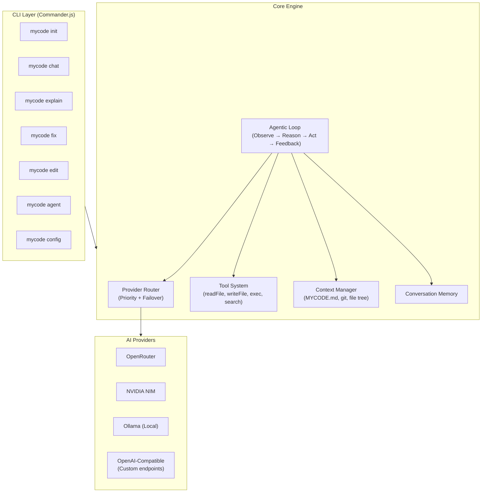
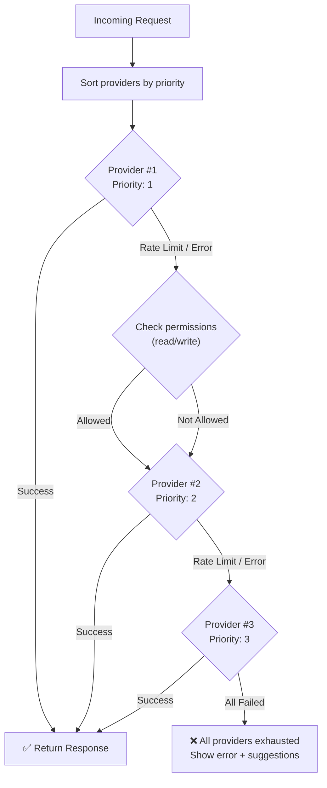

# MyCode — Multi-Provider AI Coding Terminal Tool

Build a production-grade, provider-agnostic AI coding agent (like Claude Code) installable via `npm install -g mycode`, with automatic failover across multiple AI providers.

## User Review Required

> [!IMPORTANT]
> **Tool Name:** The PDF and workspace folder both use `mycode`. Should we keep this name or use something else? (`mycode` is clean and memorable, but we should check npm availability.)

> [!IMPORTANT]
> **Provider Support Scope for V1:** Based on your PDF, you want support for OpenRouter, NVIDIA NIM, Ollama (local), and potentially others. Should V1 support all of these, or should we start with OpenRouter + Ollama (the two most common) and add more in V2?

> [!WARNING]
> **"Zenmux" Provider:** I couldn't find a public AI provider called "Zenmux." Could you clarify what this is? Is it a custom/private API, or perhaps a different spelling (e.g., Zenith, ZenML)?

## Open Questions

1. **Agent Mode Scope:** Should V1 include a full autonomous "agent" mode (reads files, writes code, runs commands, iterates) or start with a simpler "chat + explain + edit" mode and build toward agent mode?
2. **Permission Model:** For file write/command execution, should we always ask for user confirmation (safe but slower), or allow a `--yes` / `--trust` flag for experienced users?
3. **Context File:** Should we support a `MYCODE.md` file (like `CLAUDE.md`) in project roots for project-specific instructions?

---

## Architecture Overview



---

## Proposed Changes

### 1. Project Scaffolding & Configuration

#### [NEW] [package.json](file:///c:/Users/Admin/Desktop/mycode/package.json)

```json
{
  "name": "mycode",
  "version": "0.1.0",
  "description": "Multi-provider AI coding agent for the terminal",
  "type": "module",
  "bin": { "mycode": "./bin/mycode.js" },
  "engines": { "node": ">=18.0.0" }
}
```

**Key dependencies:**
| Package | Purpose |
|---|---|
| `commander` | CLI argument parsing & subcommands |
| `chalk` | Terminal colors & styling |
| `ora` | Elegant loading spinners |
| `inquirer` | Interactive prompts (confirmation dialogs) |
| `openai` | Unified SDK for OpenAI-compatible APIs (OpenRouter, NIM, custom) |
| `ollama` | Official Ollama SDK for local models |
| `marked` + `marked-terminal` | Render markdown in terminal |
| `diff` | Generate unified diffs for file edits |
| `glob` | File pattern matching |
| `tree-kill` | Clean process termination |

#### [NEW] [bin/mycode.js](file:///c:/Users/Admin/Desktop/mycode/bin/mycode.js)
- Entry point with `#!/usr/bin/env node` shebang
- Registers all CLI commands via Commander.js
- Initializes config directory at `C:\Users\{username}\.mycode\`

#### [NEW] [.mycode/settings.json](file:///C:/Users/{username}/.mycode/settings.json) *(created on `mycode init`)*
User's provider configuration file, created in the user's home directory:

```json
{
  "providers": [
    {
      "priority": 1,
      "name": "OpenRouter GPT-5",
      "api_provider": "openrouter",
      "model": "openai/gpt-5",
      "api_key": "sk-or-xxxx",
      "base_url": "https://openrouter.ai/api/v1",
      "read": true,
      "write": true,
      "max_retries": 3
    },
    {
      "priority": 2,
      "name": "NVIDIA NIM Llama",
      "api_provider": "nvidia_nim",
      "model": "meta/llama-3.1-70b-instruct",
      "api_key": "nvapi-xxxx",
      "base_url": "https://integrate.api.nvidia.com/v1",
      "read": true,
      "write": true,
      "max_retries": 2
    },
    {
      "priority": 3,
      "name": "Local Ollama",
      "api_provider": "ollama",
      "model": "llama3.1:8b",
      "api_key": "",
      "base_url": "http://localhost:11434",
      "read": true,
      "write": false,
      "max_retries": 1
    }
  ],
  "preferences": {
    "theme": "dark",
    "confirm_writes": true,
    "confirm_commands": true,
    "max_context_files": 20,
    "log_conversations": true
  }
}
```

---

### 2. Provider Router (Multi-Provider Failover Engine)

This is the **core innovation** — the priority-based routing with automatic failover.

#### [NEW] [src/providers/router.js](file:///c:/Users/Admin/Desktop/mycode/src/providers/router.js)

**How the routing works:**



**Key behaviors:**
- Providers sorted by `priority` field (1 = highest)
- On **rate limit (429)**: Wait briefly, then failover to next provider
- On **server error (5xx)**: Immediate failover to next provider  
- On **auth error (401/403)**: Skip provider, warn user about invalid API key
- On **context length exceeded**: Try next provider (may have larger context window)
- **Read/Write permissions**: If a task requires writing files but the provider has `write: false`, skip that provider for write operations
- **Health tracking**: Track provider success/failure rates per session

#### [NEW] [src/providers/openai-compatible.js](file:///c:/Users/Admin/Desktop/mycode/src/providers/openai-compatible.js)
- Unified adapter using the `openai` npm package
- Works for: OpenRouter, NVIDIA NIM, and any OpenAI-compatible endpoint
- Handles streaming, tool calling, and structured output
- Each provider just needs a different `baseURL` and `apiKey`

#### [NEW] [src/providers/ollama-provider.js](file:///c:/Users/Admin/Desktop/mycode/src/providers/ollama-provider.js)
- Adapter using the `ollama` npm package
- Handles local model communication
- Checks if Ollama is running before attempting connection
- Supports tool calling for compatible models (Llama 3.1+, Qwen 2.5+)

#### [NEW] [src/providers/base-provider.js](file:///c:/Users/Admin/Desktop/mycode/src/providers/base-provider.js)
- Abstract base class all providers implement
- Defines the interface: `chat()`, `stream()`, `supportsTools()`, `healthCheck()`

---

### 3. Tool System (What the AI Can Do)

The AI agent needs "tools" — functions it can call to interact with the user's codebase.

#### [NEW] [src/tools/](file:///c:/Users/Admin/Desktop/mycode/src/tools/)

| Tool | File | Description |
|---|---|---|
| `readFile` | `read-file.js` | Read file contents with line numbers |
| `writeFile` | `write-file.js` | Write/overwrite a file (requires confirmation) |
| `editFile` | `edit-file.js` | Apply targeted edits using search/replace |
| `listDirectory` | `list-dir.js` | List files and directories |
| `searchFiles` | `search-files.js` | Grep/search across files using patterns |
| `executeCommand` | `exec-command.js` | Run shell commands (requires confirmation) |
| `gitStatus` | `git-status.js` | Get current git status, diff, log |

#### [NEW] [src/tools/registry.js](file:///c:/Users/Admin/Desktop/mycode/src/tools/registry.js)
- Central registry that exposes all tools in OpenAI function-calling format
- Each tool has: name, description, JSON schema for parameters
- Handles execution routing when the AI requests a tool call

---

### 4. Agentic Loop (The Brain)

#### [NEW] [src/agent/loop.js](file:///c:/Users/Admin/Desktop/mycode/src/agent/loop.js)

The core execution cycle:

```
while (task not complete) {
  1. Build context (system prompt + conversation history + tool results)
  2. Send to current provider via Router
  3. If response contains tool_calls → execute tools, add results to history
  4. If response is text → display to user
  5. If provider fails → Router handles failover automatically
  6. If user interrupts (Ctrl+C) → graceful shutdown
}
```

#### [NEW] [src/agent/system-prompt.js](file:///c:/Users/Admin/Desktop/mycode/src/agent/system-prompt.js)
- Builds the system prompt with:
  - Tool descriptions and usage instructions
  - Current working directory and project context
  - Contents of `MYCODE.md` if present
  - Git status summary
  - File tree of the project (truncated to avoid token waste)

#### [NEW] [src/agent/context.js](file:///c:/Users/Admin/Desktop/mycode/src/agent/context.js)
- Manages conversation history
- Handles token counting and context window limits
- Truncates old messages when approaching limits

---

### 5. CLI Commands

#### [NEW] [src/commands/init.js](file:///c:/Users/Admin/Desktop/mycode/src/commands/init.js)
`mycode init` — Interactive setup wizard:
1. Detects if `~/.mycode/settings.json` exists
2. Walks user through adding their first provider (API key, model selection)
3. Creates the config directory and settings file
4. Validates API key by making a test request

#### [NEW] [src/commands/chat.js](file:///c:/Users/Admin/Desktop/mycode/src/commands/chat.js)
`mycode chat` — Interactive REPL-style chat:
- Persistent conversation with the AI
- Supports multi-line input
- Renders AI responses as formatted markdown in terminal
- Shows which provider is being used
- Displays token usage and cost estimates

#### [NEW] [src/commands/explain.js](file:///c:/Users/Admin/Desktop/mycode/src/commands/explain.js)
`mycode explain <file>` — One-shot code explanation:
- Reads the file, sends it to AI with an explanation prompt
- Outputs a structured breakdown (purpose, key functions, dependencies)

#### [NEW] [src/commands/fix.js](file:///c:/Users/Admin/Desktop/mycode/src/commands/fix.js)
`mycode fix <file|error.log>` — Fix errors:
- Reads error output or file
- AI analyzes the error and proposes fixes
- Shows diff preview before applying changes

#### [NEW] [src/commands/edit.js](file:///c:/Users/Admin/Desktop/mycode/src/commands/edit.js)
`mycode edit <file> "instruction"` — AI-powered file editing:
- Reads the file, applies the instruction
- Shows a color-coded diff before writing
- Requires user confirmation

#### [NEW] [src/commands/agent.js](file:///c:/Users/Admin/Desktop/mycode/src/commands/agent.js)
`mycode agent` — Full autonomous agent mode:
- Uses the agentic loop with all tools enabled
- Can read, write, search, and execute commands
- Iterates until the task is complete or user stops it

#### [NEW] [src/commands/config.js](file:///c:/Users/Admin/Desktop/mycode/src/commands/config.js)
`mycode config` — Manage settings:
- `mycode config list` — Show current providers
- `mycode config add` — Add a new provider interactively
- `mycode config remove <name>` — Remove a provider
- `mycode config test` — Test all provider connections

---

### 6. Terminal UI Layer

#### [NEW] [src/ui/renderer.js](file:///c:/Users/Admin/Desktop/mycode/src/ui/renderer.js)
- Renders AI responses as formatted markdown (headings, code blocks, lists)
- Syntax highlighting for code blocks
- Color-coded diffs (green for additions, red for deletions)

#### [NEW] [src/ui/spinner.js](file:///c:/Users/Admin/Desktop/mycode/src/ui/spinner.js)
- Unified spinner/progress indicator
- Shows which provider is being called
- Displays "Switching to Provider #2..." on failover

#### [NEW] [src/ui/prompt.js](file:///c:/Users/Admin/Desktop/mycode/src/ui/prompt.js)
- Confirmation dialogs for file writes and command execution
- Shows what will change before applying

---

## Complete File Structure

```
mycode/
├── bin/
│   └── mycode.js              # CLI entry point (shebang)
├── src/
│   ├── commands/
│   │   ├── init.js             # Setup wizard
│   │   ├── chat.js             # Interactive chat REPL
│   │   ├── explain.js          # Explain code
│   │   ├── fix.js              # Fix errors
│   │   ├── edit.js             # AI-powered edits
│   │   ├── agent.js            # Full agent mode
│   │   └── config.js           # Manage providers
│   ├── providers/
│   │   ├── base-provider.js    # Abstract provider interface
│   │   ├── openai-compatible.js # OpenRouter, NIM, custom
│   │   ├── ollama-provider.js  # Local Ollama
│   │   └── router.js           # Priority failover engine
│   ├── tools/
│   │   ├── registry.js         # Tool registration & dispatch
│   │   ├── read-file.js        # Read files
│   │   ├── write-file.js       # Write files
│   │   ├── edit-file.js        # Search/replace edits
│   │   ├── list-dir.js         # Directory listing
│   │   ├── search-files.js     # Grep/search
│   │   ├── exec-command.js     # Shell execution
│   │   └── git-status.js       # Git operations
│   ├── agent/
│   │   ├── loop.js             # Core agentic loop
│   │   ├── system-prompt.js    # System prompt builder
│   │   └── context.js          # Conversation & context mgmt
│   ├── ui/
│   │   ├── renderer.js         # Markdown rendering
│   │   ├── spinner.js          # Loading indicators
│   │   └── prompt.js           # Confirmation dialogs
│   └── utils/
│       ├── config.js           # Config file management
│       ├── logger.js           # Logging utility
│       └── errors.js           # Error types & handling
├── package.json
├── README.md
└── .gitignore
```

---

## Implementation Order

I recommend building in this sequence to get a working prototype as fast as possible:

| Phase | What We Build | Result |
|---|---|---|
| **Phase 1** | Package scaffold + Config system + Provider Router | `mycode init` works, providers can be configured |
| **Phase 2** | OpenAI-compatible provider + Ollama provider | Can send requests to any provider |
| **Phase 3** | Chat command + Terminal UI rendering | `mycode chat` works — you can talk to AI |
| **Phase 4** | Tool system + Agentic loop | AI can read/write files, run commands |
| **Phase 5** | Remaining commands (explain, fix, edit, agent) | Full feature set |
| **Phase 6** | Polish: streaming, diffs, confirmation UX | Production quality |

---

## Verification Plan

### Automated Tests
```bash
# Unit tests for provider router failover logic
npm test

# Test config file creation
mycode init   # → should create ~/.mycode/settings.json

# Test provider connectivity
mycode config test   # → should validate all API keys
```

### Manual Verification
- Install globally with `npm install -g .` from the project root
- Run `mycode init` and configure at least 2 providers
- Run `mycode chat` and have a conversation
- Simulate failover by using an invalid API key for Provider #1
- Verify the tool gracefully switches to Provider #2 with a visible message
- Run `mycode explain package.json` on a real file
- Run `mycode agent "create a hello world Express server"` to test the full loop
