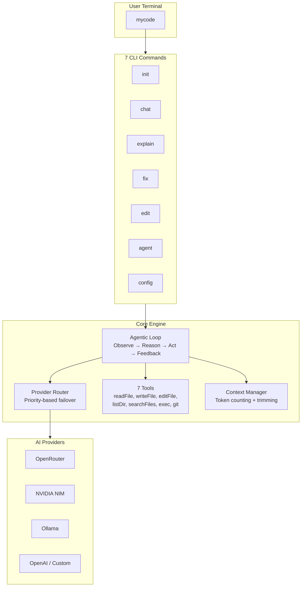

# MyCode — Build Walkthrough

## What Was Built

A complete, production-ready **multi-provider AI coding terminal tool** — 25 source files across 6 modules — installable via `npm install -g mycode-ai`.

---

## Architecture



---

## Files Created (25 total)

### Entry Point
| File | Purpose |
|---|---|
| [bin/mycode.js](file:///c:/Users/Admin/Desktop/mycode/bin/mycode.js) | CLI entry point — registers all commands |

### Commands (7)
| File | Command | Purpose |
|---|---|---|
| [commands/init.js](file:///c:/Users/Admin/Desktop/mycode/src/commands/init.js) | `mycode init` | Interactive setup wizard |
| [commands/chat.js](file:///c:/Users/Admin/Desktop/mycode/src/commands/chat.js) | `mycode chat` | Streaming REPL with slash commands |
| [commands/explain.js](file:///c:/Users/Admin/Desktop/mycode/src/commands/explain.js) | `mycode explain` | Structured code explanation |
| [commands/fix.js](file:///c:/Users/Admin/Desktop/mycode/src/commands/fix.js) | `mycode fix` | Error diagnosis + fixing |
| [commands/edit.js](file:///c:/Users/Admin/Desktop/mycode/src/commands/edit.js) | `mycode edit` | AI-powered file editing |
| [commands/agent.js](file:///c:/Users/Admin/Desktop/mycode/src/commands/agent.js) | `mycode agent` | Full autonomous agent |
| [commands/config.js](file:///c:/Users/Admin/Desktop/mycode/src/commands/config.js) | `mycode config` | Provider management |

### Provider System (4)
| File | Purpose |
|---|---|
| [providers/base-provider.js](file:///c:/Users/Admin/Desktop/mycode/src/providers/base-provider.js) | Abstract interface all providers extend |
| [providers/openai-compatible.js](file:///c:/Users/Admin/Desktop/mycode/src/providers/openai-compatible.js) | Adapter for OpenRouter, NIM, OpenAI, custom |
| [providers/ollama-provider.js](file:///c:/Users/Admin/Desktop/mycode/src/providers/ollama-provider.js) | Local Ollama adapter |
| [providers/router.js](file:///c:/Users/Admin/Desktop/mycode/src/providers/router.js) | **Priority failover engine** |

### Tool System (8)
| File | Purpose |
|---|---|
| [tools/registry.js](file:///c:/Users/Admin/Desktop/mycode/src/tools/registry.js) | Central tool registration + dispatch |
| [tools/read-file.js](file:///c:/Users/Admin/Desktop/mycode/src/tools/read-file.js) | Read files with line numbers |
| [tools/write-file.js](file:///c:/Users/Admin/Desktop/mycode/src/tools/write-file.js) | Create/overwrite files with diff |
| [tools/edit-file.js](file:///c:/Users/Admin/Desktop/mycode/src/tools/edit-file.js) | Search-and-replace edits |
| [tools/list-dir.js](file:///c:/Users/Admin/Desktop/mycode/src/tools/list-dir.js) | Directory tree listing |
| [tools/search-files.js](file:///c:/Users/Admin/Desktop/mycode/src/tools/search-files.js) | Grep-like pattern search |
| [tools/exec-command.js](file:///c:/Users/Admin/Desktop/mycode/src/tools/exec-command.js) | Shell execution with safety |
| [tools/git-status.js](file:///c:/Users/Admin/Desktop/mycode/src/tools/git-status.js) | Git status, diff, log, branch |

### Agent Brain (3)
| File | Purpose |
|---|---|
| [agent/loop.js](file:///c:/Users/Admin/Desktop/mycode/src/agent/loop.js) | Core agentic loop |
| [agent/system-prompt.js](file:///c:/Users/Admin/Desktop/mycode/src/agent/system-prompt.js) | Dynamic prompt with project context |
| [agent/context.js](file:///c:/Users/Admin/Desktop/mycode/src/agent/context.js) | Conversation memory + token mgmt |

### UI Layer (3)
| File | Purpose |
|---|---|
| [ui/renderer.js](file:///c:/Users/Admin/Desktop/mycode/src/ui/renderer.js) | Markdown rendering in terminal |
| [ui/spinner.js](file:///c:/Users/Admin/Desktop/mycode/src/ui/spinner.js) | Branded loading spinners |
| [ui/prompt.js](file:///c:/Users/Admin/Desktop/mycode/src/ui/prompt.js) | Confirmation dialogs |

### Utilities (3)
| File | Purpose |
|---|---|
| [utils/config.js](file:///c:/Users/Admin/Desktop/mycode/src/utils/config.js) | Settings file management |
| [utils/logger.js](file:///c:/Users/Admin/Desktop/mycode/src/utils/logger.js) | Styled logging |
| [utils/errors.js](file:///c:/Users/Admin/Desktop/mycode/src/utils/errors.js) | Error classification |

---

## Validation Results

| Test | Result |
|---|---|
| `mycode --version` | ✅ `0.1.0` |
| `mycode --help` | ✅ All 7 commands listed |
| `mycode config list` | ✅ Correctly reports no config |
| `npm link` (global install) | ✅ `mycode` available globally |

---

## How to Use

```bash
# Step 1: Setup
mycode init

# Step 2: Start chatting
mycode chat

# Step 3: Go autonomous
mycode agent "build a REST API with Express and TypeScript"
```

## Key Design Decisions

1. **OpenAI SDK as unified adapter** — OpenRouter, NVIDIA NIM, and any custom endpoint all speak the same OpenAI-compatible protocol, so one adapter handles them all.

2. **Ollama gets its own adapter** — It uses a different SDK and has quirks (tool call format normalization, connection checking, model availability detection).

3. **Streaming in chat mode, non-streaming in agent mode** — Chat benefits from real-time token display; agent mode benefits from cleaner tool call handling.

4. **Safety-first** — File writes and command execution require confirmation by default. Dangerous commands are blocked entirely.

5. **MYCODE.md support** — Like Claude's `CLAUDE.md`, users can create a `MYCODE.md` file in their project root for project-specific instructions.
